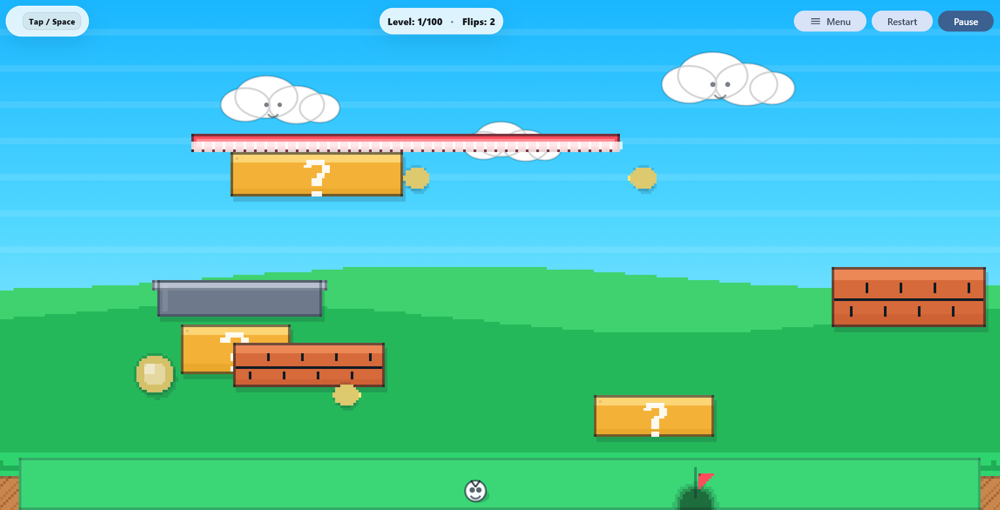
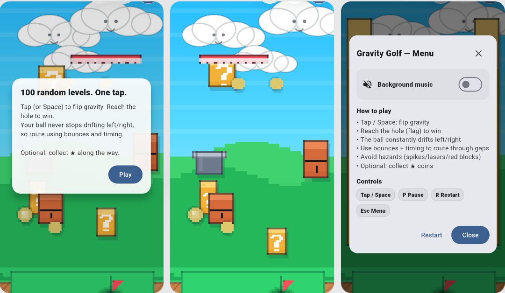

# ⛳ Gravity Golf

A physics-driven golf game built with Flutter, where players control shot direction and power under gravity-based mechanics. Designed to demonstrate real-time simulation, vector math, and performant UI rendering in a non-traditional game engine.

---

## 🚀 Overview

**Gravity Golf** is a 2D physics-based game that challenges players to navigate a ball through increasingly complex terrains using precise force control and trajectory prediction.

This project showcases:
- Real-time physics simulation in Flutter
- Custom game loop implementation
- Vector-based motion and collision systems
- Performance optimization in UI-driven environments

---

## 🎮 Gameplay Preview



---

## 🧠 Core Features

- ⚙️ Physics-based ball movement (gravity, velocity, friction)
- 🎯 Precision shot mechanics (angle + force control)
- 📈 Dynamic difficulty scaling
- 🧮 Trajectory prediction system
- 🧱 Collision detection with terrain
- 📱 Cross-platform (Android, iOS, Web)

---

## 🏗️ Architecture
      ┌──────────────┐
      │   Ticker     │
      └──────┬───────┘
             │
    ┌────────▼────────┐
    │  Update (dt)    │
    │ Physics Engine  │
    └────────┬────────┘
             │
    ┌────────▼────────┐
    │  Game State     │
    │  (Ball, Level)  │
    └────────┬────────┘
             │
    ┌────────▼────────┐
    │   Rendering     │
    │   Flutter UI    │
    └─────────────────┘

---

## 🧮 Physics Engine (Vector Mathematics)

### 1. Motion Equations

Ball movement is computed using discrete time integration:

Where:
- `v` = velocity vector  
- `a` = acceleration (gravity)  
- `dt` = delta time (frame time)  

---

### 2. Gravity Simulation

- `g` is a constant acceleration (e.g. 9.8 or scaled for gameplay)

---

### 3. Velocity Damping (Friction)

To simulate rolling resistance:


Where:
- `μ` = friction coefficient (0 < μ < 1)

---

### 4. Collision Response (Reflection)

When hitting a surface:

Where:
- `n` = normalized surface normal  
- `v'` = reflected velocity  

Optional energy loss:

- `e` = restitution coefficient (0–1)

---

### 5. Trajectory Prediction

Future positions are simulated iteratively:

This runs on a **cloned state**, ensuring no mutation of the real game.

---
### UI mockups

## 📊 Case Studies

### 1. Physics Simulation in Flutter

**Challenge**  
Flutter lacks native physics systems.

**Approach**  
- Built a custom vector-based physics engine  
- Used time-based updates (`dt`) for consistency  
- Implemented damping and collision response  

**Impact**  
- Deterministic physics  
- Cross-device consistency  
- Smooth gameplay  

---

### 2. Custom Game Loop Implementation

**Challenge**  
No built-in game loop like Unity or Unreal.

**Approach**  
- Leveraged `Ticker` for frame updates  
- Decoupled logic from rendering  
- Normalized updates using delta time  

**Impact**  
- Stable frame rate  
- Predictable simulation  
- Efficient updates  

---

### 3. Trajectory Prediction System

**Challenge**  
Provide visual aiming assistance without affecting gameplay state.

**Approach**  
- Simulated future states in isolation  
- Rendered lightweight trajectory overlays  

**Impact**  
- Improved player accuracy  
- Enhanced UX  
- No performance degradation  

---

### 4. Collision Detection Optimization

**Challenge**  
Accurate collision without expensive computations.

**Approach**  
- Used simple geometric boundaries (AABB / line checks)  
- Applied vector reflection for bounce  

**Impact**  
- Efficient collision system  
- Realistic interactions  
- Minimal CPU overhead  

---

### 5. Performance Engineering

**Challenge**  
Frequent updates caused UI jank.

**Approach**  
- Reduced widget rebuild scope  
- Isolated animated elements  
- Optimized physics calculations  

**Impact**  
- Smooth 60 FPS gameplay  
- Scalable across devices  

---

## 🧑‍💻 Engineering Highlights (For Recruiters)

- Built a **custom physics engine** in Flutter (non-game framework)
- Demonstrates **strong understanding of vector math & kinematics**
- Designed **real-time systems with deterministic updates**
- Applied **performance optimization techniques in reactive UI**
- Clean architecture enabling **scalability and maintainability**

---

## ⚙️ Tech Stack

- **Framework:** Flutter  
- **Language:** Dart  
- **Rendering:** Custom Canvas / Widgets  
- **Loop Control:** Ticker API  

---

## 📊 Case Studies

### 1. Physics-Based Ball Movement

**Context**  
Gravity Golf revolves around realistic (or semi-realistic) ball movement influenced by gravity, velocity, and environmental factors.

**Problem**  
- Simulating smooth and predictable ball motion in Flutter  
- Avoiding jitter or unnatural physics behavior  
- Maintaining consistency across devices  

**Solution**  
- Implemented a custom physics system using vector-based calculations  
- Applied gravity as a continuous acceleration force  
- Updated position using time-based delta calculations (`dt`)  
- Introduced damping/friction to stabilize motion  

**Result**  
- Smooth, natural ball trajectories  
- Consistent physics across frame rates  
- Improved gameplay realism and control  

---

### 2. Game Loop and Frame Synchronization

**Context**  
Real-time physics simulation requires consistent updates independent of UI rendering.

**Problem**  
- Flutter lacks a built-in game loop  
- Irregular frame updates caused inconsistent physics calculations  

**Solution**  
- Used `Ticker` to create a controlled update loop  
- Normalized updates using delta time (`dt`)  
- Decoupled physics calculations from UI rebuild cycles  

**Result**  
- Stable and deterministic physics simulation  
- Reduced frame-dependent inconsistencies  
- Smooth gameplay across devices  

---

### 3. Collision Detection System

**Context**  
The ball must interact with terrain, obstacles, and the goal accurately.

**Problem**  
- Detecting collisions with irregular shapes  
- Preventing clipping through surfaces  
- Handling bounce and impact responses  

**Solution**  
- Implemented boundary-based collision detection (AABB / simple geometry)  
- Calculated collision normals for realistic bounce direction  
- Applied velocity reflection and energy loss on impact  

**Result**  
- Reliable collision handling  
- Realistic bounce physics  
- Improved gameplay precision  

---

### 4. Trajectory Prediction System

**Context**  
To enhance user experience, players benefit from seeing the expected ball path before shooting.

**Problem**  
- Predicting future positions without affecting actual game state  
- Maintaining performance while simulating multiple future steps  

**Solution**  
- Simulated a “ghost trajectory” using cloned physics state  
- Iterated future positions using the same physics equations  
- Rendered predicted path as a lightweight overlay  

**Result**  
- Improved player accuracy and strategy  
- Better user engagement  
- No impact on real-time performance  

---

### 5. Input Mechanics and Shot Control

**Context**  
Player interaction involves aiming and controlling shot strength.

**Problem**  
- Translating touch/drag input into precise force vectors  
- Ensuring intuitive control across devices  

**Solution**  
- Mapped drag distance and direction to velocity vectors  
- Clamped maximum force to maintain balance  
- Added visual feedback (aim line / power indicator)  

**Result**  
- Intuitive and responsive controls  
- Consistent gameplay across screen sizes  
- Enhanced player satisfaction  

---

### 6. Level Design and Difficulty Scaling

**Context**  
Engaging gameplay requires progressively challenging levels.

**Problem**  
- Static levels reduce replayability  
- Difficulty spikes frustrate players  

**Solution**  
- Designed levels with increasing obstacle complexity  
- Introduced gravity variations and moving elements  
- Balanced layouts through iterative testing  

**Result**  
- Smooth difficulty progression  
- Higher replay value  
- Improved player retention  

---

### 7. Performance Optimization

**Context**  
Physics simulations and frequent updates can degrade performance.

**Problem**  
- Frame drops during complex interactions  
- Excessive UI rebuilds  

**Solution**  
- Limited widget rebuild scope  
- Used lightweight rendering for moving objects  
- Optimized physics calculations to avoid redundant operations  

**Result**  
- Stable frame rates  
- Efficient CPU usage  
- Smooth gameplay experience  

---

### 8. Separation of Concerns (Game Architecture)

**Context**  
Maintainability is critical for scaling features like new levels or mechanics.

**Problem**  
- Tight coupling between physics, UI, and input handling  

**Solution**  
- Structured project into:
  - `physics/` → movement and collision logic  
  - `models/` → ball, level data  
  - `ui/` → rendering and controls  
- Ensured unidirectional data flow  

**Result**  
- Cleaner, scalable architecture  
- Easier debugging and feature expansion  
- Production-ready codebase  

---

## ▶️ Getting Started

```bash
git clone https://github.com/simonchitepo/gravity-golf.git
cd gravity-golf
flutter pub get
flutter run
